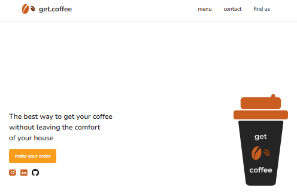

 

 

# 📌 Desafio 08 - Cafeteria

### Contextualização:

Site criado para treinar a e relembrar sobre JavaScript e React, trazendo todo conhecimento até então para essa nova linguagem e framework, utilizando HTML, CSS, JavaScript e React.

## Imagens da aplicação:

 

## Projeto da aplicação:

📌 [Figma](https://www.figma.com/design/Ki8xFmvyHwjrAJmNgZmp6U/get-coffee-layout-(Copy)?node-id=0-1&p=f&t=Fv4twBNwEqR3RbXa-0)

## Execução da aplicação:

📌 [Deploy](https://vai-na-web-fullstack-cafeteria.vercel.app/)

  
 
[<- Retornar](https://github.com/GilvanPOliveira/VaiNaWeb/tree/main/CicloFullStack)
