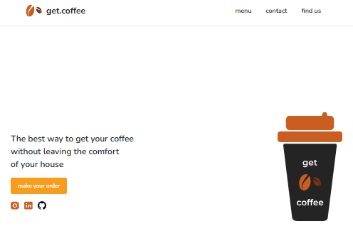

# Cafeteria

Aplicação web desenvolvida para prática de JavaScript e React.

##

## Sobre

Este projeto foi desenvolvido como desafio prático com foco na aplicação de conceitos de desenvolvimento frontend utilizando React.

A proposta foi consolidar conhecimentos adquiridos anteriormente, aplicando-os na construção de uma interface completa.

##

## Objetivo

Consolidar conhecimentos em desenvolvimento frontend, incluindo:

* estruturação de páginas com HTML
* estilização com CSS
* manipulação com JavaScript
* desenvolvimento de interfaces com React
* organização de código

##

## Funcionalidades

### Interface

* layout de página para apresentação de produtos
* organização visual de conteúdo

##

### Componentização

* utilização de componentes React
* separação de responsabilidades

##

### Responsividade

* adaptação para diferentes tamanhos de tela

##

## Imagens da Aplicação

 

##

## Projeto

* [Figma](https://www.figma.com/design/Ki8xFmvyHwjrAJmNgZmp6U/get-coffee-layout-(Copy)?node-id=0-1&p=f&t=Fv4twBNwEqR3RbXa-0)

##

## Execução

* [Deploy](https://vai-na-web-fullstack-cafeteria.vercel.app/)

##

## Tecnologias Utilizadas

* HTML  
* CSS  
* JavaScript  
* React  

##

## Contato

* Portfólio: https://gilvanpoliveira.github.io  
* Email: [gilvanoliveira06@gmail.com](mailto:gilvanoliveira06@gmail.com)

##

[← Voltar](https://github.com/GilvanPOliveira/VaiNaWeb/tree/main/CicloFullStack)
