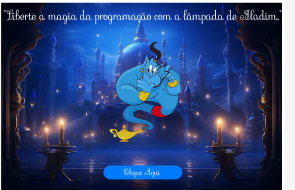

 

 

# 📌 Desafio 11 - Desejos

Site criado para treinar JavaScript, React e Saas.

### Contextualização:

Olá, pessoal! 🧞

Neste novo projeto, vamos criar um site inspirado no mundo mágico de Aladin, com o gênio da lâmpada. Onde ao clicar na lâmpada mágica, surgirá o gênio, que concederá 3 desejos ao usuário que a encontrar!🪔

- Instruções do Desafio 📝:
  - a) Utilize o design disponível no Figma que foi compartilhado em anexo. Siga todos os detalhes e elementos gráficos com atenção!  🧐
  - b) Desenvolva o site utilizando HTML  e SASS. Lembre-se de aplicar boas práticas de codificação e estruturação do projeto!  ⚒️
  - c) Implemente o clique na lâmpada para que o gênio apareça e ofereça 3 desejos ao usuário. Pense em animações e efeitos para deixar tudo ainda mais divertido e dinâmico! 🪄

Vamos arrasar neste desafio e mostrar todo o nosso talento! Mal posso esperar para ver as criações de cada um de vocês! 🤞

## Imagens da aplicação:

 

## Projeto da aplicação:

📌 [Figma](https://www.figma.com/design/LBODsPDSyKhBv5lex4Vrsv/Untitled?node-id=1-2&t=X6tEPmggbEMJWmCX-0)

## Execução da aplicação:

📌 [Deploy](https://vai-na-web-fullstack-desejos.vercel.app/)

  
 
[<- Retornar](https://github.com/GilvanPOliveira/VaiNaWeb/tree/main/CicloFullStack)
