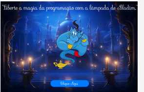

# Desejos

Aplicação web desenvolvida para prática de JavaScript, React e Sass.

##

## Sobre

Este projeto foi desenvolvido como desafio prático com foco na criação de uma interface interativa inspirada em um tema lúdico.

A proposta foi aplicar conceitos de desenvolvimento frontend em uma aplicação dinâmica com interação do usuário.

##

## Objetivo

Consolidar conhecimentos em desenvolvimento frontend, incluindo:

* estruturação de páginas com HTML
* estilização com CSS e Sass
* manipulação com JavaScript
* desenvolvimento de interfaces com React
* criação de interações e efeitos visuais

##

## Funcionalidades

### Interface

* layout temático inspirado em fantasia
* organização visual de elementos interativos

##

### Interação

* exibição de elementos a partir de ações do usuário
* uso de efeitos visuais para feedback

##

### Responsividade

* adaptação para diferentes tamanhos de tela

##

## Imagens da Aplicação

 

##

## Projeto

* [Figma](https://www.figma.com/design/LBODsPDSyKhBv5lex4Vrsv/Untitled?node-id=1-2&t=X6tEPmggbEMJWmCX-0)

##

## Execução

* [Deploy](https://vai-na-web-fullstack-desejos.vercel.app/)

##

## Tecnologias Utilizadas

* HTML  
* CSS  
* JavaScript  
* React  
* Sass  

##

## Contato

* Portfólio: https://gilvanpoliveira.github.io  
* Email: [gilvanoliveira06@gmail.com](mailto:gilvanoliveira06@gmail.com)

##

[← Voltar](https://github.com/GilvanPOliveira/VaiNaWeb/tree/main/CicloFullStack)
