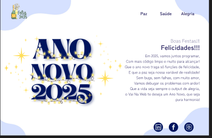

 

 

# 📌 Desafio de Revisão - Reforçar Conhecimentos Adquiridos!

Criação de um site para estudos de parâmetros, métodos e funções abordados antes do recesso, para demonstrar prática e o conhecimento adquirido.

### Contextualização:

A prática leva à perfeição!!!💪✨

Aproveitem para colocar em prática tudo o que aprenderam em React. Essa é uma ótima oportunidade para relembrar os conceitos e reforçar os conhecimentos adquiridos! 🚀👩‍💻👨‍💻

Por exemplo: Criem uma página usando um array de objetos com um tema que vocês amam — pode ser filmes, séries, comidas, jogos… qualquer coisa que curtam de verdade!
Cada item contendo:
* Um nome ou título;
* Uma imagem (caprichem nos links, hein? 😏);
* Uma descrição, preço, ou algo interessante;
* Um texto alternativo pra imagem;
Depois, é só usar o map() pra mostrar tudo na tela de forma dinâmica.
Incrementar Hooks, como useState. 
Estilizar utilizando Saas.
(...)

Quero ver a criatividade voando alto! 🛫🔥

## Imagens da aplicação:

 

## Projeto da aplicação:

📌 [Figma](https://www.figma.com/design/n6UEdCbVWyPzPwHWsdhHCM/Ano-Novo-2025?node-id=0-1&p=f&t=Fwg05dFCXGEJeX1f-0)

## Execução da aplicação:

📌 [Deploy](https://vai-na-web-fullstack-revisao.vercel.app/)

  
 
[<- Retornar](https://github.com/GilvanPOliveira/VaiNaWeb/tree/main/CicloFullStack)
