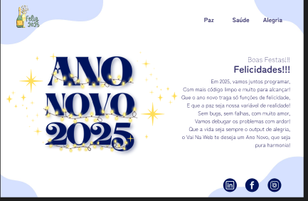

# Revisão

Aplicação web desenvolvida para reforço de conceitos em React.

##

## Sobre

Este projeto foi desenvolvido como atividade de revisão com foco na prática dos conceitos estudados anteriormente.

A proposta foi aplicar conhecimentos em uma aplicação simples, utilizando dados dinâmicos e componentes.

##

## Objetivo

Consolidar conhecimentos em desenvolvimento frontend, incluindo:

* manipulação de dados com arrays
* renderização dinâmica com map
* uso de hooks como useState
* organização de componentes
* estilização com Sass

##

## Funcionalidades

### Interface

* exibição de lista de itens dinâmicos
* organização visual baseada em dados

##

### Dados Dinâmicos

* uso de array de objetos
* renderização de conteúdo com map

##

### Interação

* uso de estado com React
* atualização dinâmica da interface

##

### Responsividade

* adaptação para diferentes tamanhos de tela

##

## Imagens da Aplicação

 

##

## Projeto

* [Figma](https://www.figma.com/design/n6UEdCbVWyPzPwHWsdhHCM/Ano-Novo-2025?node-id=0-1&p=f&t=Fwg05dFCXGEJeX1f-0)

##

## Execução

* [Deploy](https://vai-na-web-fullstack-revisao.vercel.app/)

##

## Tecnologias Utilizadas

* HTML  
* CSS  
* JavaScript  
* React  
* Sass  

##

## Contato

* Portfólio: https://gilvanpoliveira.github.io  
* Email: [gilvanoliveira06@gmail.com](mailto:gilvanoliveira06@gmail.com)

##

[← Voltar](https://github.com/GilvanPOliveira/VaiNaWeb/tree/main/CicloFullStack)
