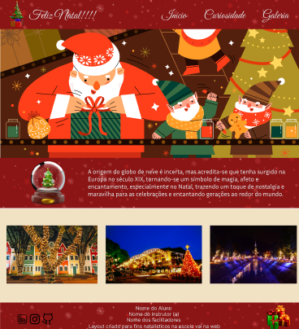

 

 

# 📌 Desafio Extra - Projeto Natalino 🎅(2024)

Projeto de Natal, onde a proposta do desafio era criar um site com a temática natalina, referente a curiosidades de natal, utilizando todo conteúdo aprendido até o momento, com a proposta de treinar tudo que foi estudado, responsividade, organização, estilização e novas técnicas.

### Contextualização:

Oláa devs! 🌟 Como estão??    

O Natal já passou mas olha o que ele nos deixou! 🎅🎄 
Esse projeto aqui do Figma é uma ótima ideia para praticarmos o que aprendemos em aula. 🚀 
Vamos aproveitar essa oportunidade para nos divertir e aprimorar ainda mais nossas habilidades!
Vamos nos unir e criar incríveis projetos para 2025! 💪🚀 
Juntos, podemos alcançar grandes conquistas.

## Imagens da aplicação:

 

## Projeto da aplicação:

📌 [Figma](https://www.figma.com/design/yoLyVEpui0ttcMZQxKxlIs/Desafio-Natal?node-id=0-1&p=f&t=y1BIFLo8Wyjitftd-0)

## Execução da aplicação:

📌 [Deploy](https://vai-na-web-natal-2024.vercel.app/)

  
 
[<- Retornar](https://github.com/GilvanPOliveira/VaiNaWeb/tree/main/ProjetoNatal)

