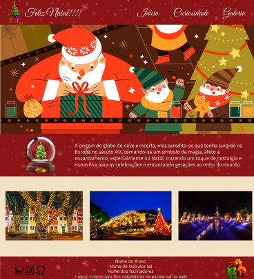

# Projeto Natalino 2024

Aplicação web com temática natalina desenvolvida para apresentação de curiosidades sobre o Natal.

##

## Sobre

Este projeto foi desenvolvido como desafio prático com foco na criação de uma interface temática, aplicando conceitos de desenvolvimento frontend.

A proposta foi consolidar conhecimentos adquiridos ao longo dos estudos por meio de um projeto completo.

##

## Objetivo

Consolidar conhecimentos em desenvolvimento frontend, incluindo:

* estruturação de páginas com HTML
* estilização com CSS
* construção de layouts responsivos
* organização de código
* aplicação prática de conceitos visuais

##

## Funcionalidades

### Interface

* página com temática natalina
* exibição de conteúdos e curiosidades

##

### Responsividade

* adaptação para diferentes tamanhos de tela

##

## Imagens da Aplicação

 

##

## Projeto

* [Figma](https://www.figma.com/design/yoLyVEpui0ttcMZQxKxlIs/Desafio-Natal?node-id=0-1&p=f&t=y1BIFLo8Wyjitftd-0)

##

## Execução

* [Deploy](https://vai-na-web-natal-2024.vercel.app/)

##

## Tecnologias Utilizadas

* HTML  
* CSS  

##

## Contato

* Portfólio: https://gilvanpoliveira.github.io  
* Email: [gilvanoliveira06@gmail.com](mailto:gilvanoliveira06@gmail.com)

##

[← Voltar](https://github.com/GilvanPOliveira/VaiNaWeb/tree/main/ProjetoNatal)
