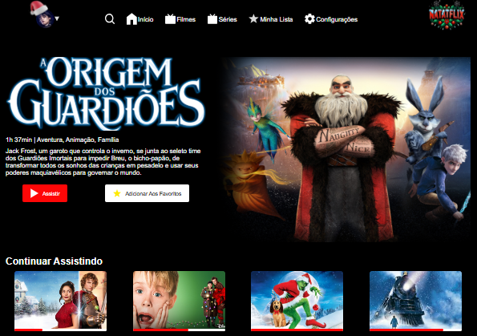

 

 

# 📌 Desafio Extra - Projeto NatalFlix 🎅(2024)

Projeto onde a proposta do desafio era elaborar um site com a temática natalina para filmes, um streaming, o NatalFlix! Utilizando todo conteúdo aprendido, com a proposta de treinar tudo que foi estudado até o momento, responsividade, organização, estilização e novas técnicas.

### Contextualização:

Oláa devs! 🌟 Como estão??    

O Natal já passou mas olha o que ele nos deixou! 🎅🎄 
Esse projeto aqui do Figma é uma ótima ideia para praticarmos o que aprendemos em aula. 🚀 
Vamos aproveitar essa oportunidade para nos divertir e aprimorar ainda mais nossas habilidades!
Vamos nos unir e criar incríveis projetos para 2025! 💪🚀 
Juntos, podemos alcançar grandes conquistas.

## Imagens da aplicação:

 

## Projeto da aplicação:

📌 [Figma](https://www.figma.com/design/5GZiDiMXLdazvjzjOqF3Pw/NatalFlix-(Copy)?node-id=0-1&p=f&t=tBZRGeWi8hrKQ7rl-0)

## Execução da aplicação:

📌 [Deploy](https://vai-na-web-natal-natalflix.vercel.app/)

  

[<- Retornar](https://github.com/GilvanPOliveira/VaiNaWeb/tree/main/ProjetoNatal)
