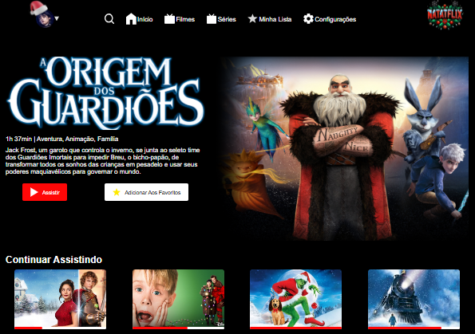

# NatalFlix 2024

Aplicação web com temática natalina simulando uma plataforma de streaming de filmes.

##

## Sobre

Este projeto foi desenvolvido como desafio prático com foco na criação de uma interface inspirada em plataformas de streaming.

A proposta foi aplicar conceitos de desenvolvimento frontend em um contexto temático, consolidando o aprendizado em um projeto completo.

##

## Objetivo

Consolidar conhecimentos em desenvolvimento frontend, incluindo:

* estruturação de páginas com HTML
* estilização com CSS
* construção de layouts responsivos
* organização de código
* aplicação prática de interfaces inspiradas em produtos reais

##

## Funcionalidades

### Interface

* layout inspirado em plataformas de streaming
* exibição de conteúdos em formato de catálogo

##

### Responsividade

* adaptação para diferentes tamanhos de tela

##

## Imagens da Aplicação

 

##

## Projeto

* [Figma](https://www.figma.com/design/5GZiDiMXLdazvjzjOqF3Pw/NatalFlix-(Copy)?node-id=0-1&p=f&t=tBZRGeWi8hrKQ7rl-0)

##

## Execução

* [Deploy](https://vai-na-web-natal-natalflix.vercel.app/)

##

## Tecnologias Utilizadas

* HTML  
* CSS  
* JavaScript  

##

## Contato

* Portfólio: https://gilvanpoliveira.github.io  
* Email: [gilvanoliveira06@gmail.com](mailto:gilvanoliveira06@gmail.com)

##

[← Voltar](https://github.com/GilvanPOliveira/VaiNaWeb/tree/main/ProjetoNatal)
