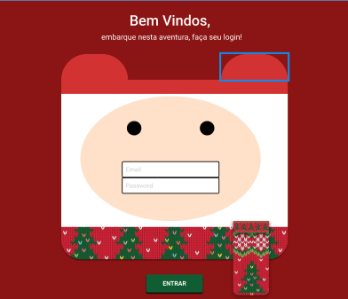

# Login NatalFlix 2024

Aplicação web para autenticação de usuários na plataforma NatalFlix.

##

## Sobre

Este projeto foi desenvolvido como complemento ao NatalFlix, com foco na criação de uma interface de login.

A proposta foi aplicar conceitos de desenvolvimento frontend em uma tela de autenticação, consolidando o aprendizado em um fluxo completo de acesso.

##

## Objetivo

Consolidar conhecimentos em desenvolvimento frontend, incluindo:

* estruturação de páginas com HTML
* estilização com CSS
* construção de layouts responsivos
* organização de código
* criação de interfaces de autenticação

##

## Funcionalidades

### Interface de Login

* formulário de autenticação de usuário
* campos para entrada de dados

##

### Layout

* interface alinhada ao tema NatalFlix
* organização visual focada em usabilidade

##

### Responsividade

* adaptação para diferentes tamanhos de tela

##

## Imagens da Aplicação

 

##

## Projeto

* [Figma](https://www.figma.com/design/vHTaUvhU4cNdVsXb9VdjDT/FINN---Login-(Copy)?node-id=0-1&p=f&t=apB9u6AzRUwL7r9B-0)

##

## Execução

* [Deploy](https://vai-na-web-natal-natalflix-login.vercel.app/)

##

## Tecnologias Utilizadas

* HTML  
* CSS  
* JavaScript  

##

## Contato

* Portfólio: https://gilvanpoliveira.github.io  
* Email: [gilvanoliveira06@gmail.com](mailto:gilvanoliveira06@gmail.com)

##

[← Voltar](https://github.com/GilvanPOliveira/VaiNaWeb/tree/main/ProjetoNatal)
